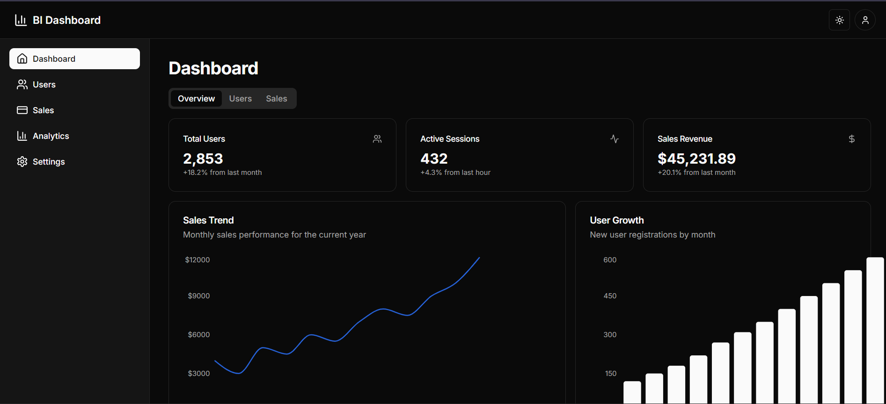

# Business Intelligence Dashboard

A comprehensive Business Intelligence (BI) tool with user authentication, data visualization, and interactive dashboards displaying meaningful business metrics.



## 🚀 Features

### User Authentication

- **Login System**: Secure email and password authentication
- **Session Management**: "Keep me logged in" functionality
- **Auto-Logout**: Automatic logout after 1 minute of inactivity (when "Keep me logged in" is not selected)
- **Registration**: New user registration with form validation
- **Protected Routes**: Secure access to dashboard for authenticated users only

### Dashboard

- **Metrics Summary**: Key business metrics displayed in cards
  - Total Users
  - Active Sessions
  - Sales Revenue
- **Data Visualization**: Interactive charts powered by Recharts
  - Line Chart for sales trends
  - Bar Chart for user growth
  - Pie/Donut Chart for category distribution
- **Data Tables**: Sortable and filterable tables for:
  - User data
  - Sales transactions
- **Responsive Design**: Optimized for desktop, tablet, and mobile devices

### Additional Features

- **Dark Mode**: Toggle between light and dark themes
- **Toast Notifications**: User-friendly notifications using Sonner
- **Tab-based Navigation**: Easy switching between dashboard views
- **Responsive Sidebar**: Collapsible navigation for mobile devices

## 🛠️ Tech Stack

- **Framework**: Next.js 14 (App Router)
- **Styling**: Tailwind CSS
- **UI Components**: shadcn/ui
- **State Management**: React Context API
- **Data Visualization**: Recharts
- **Authentication**: Custom JWT implementation
- **Toast Notifications**: Sonner
- **Tables**: TanStack Table (React Table)

## 📋 Prerequisites

- Node.js 18.x or higher
- npm or yarn

## 🔧 Installation & Setup

1. **Clone the repository**

   ```
   
   bash
   git clone https://github.com/Nwanne-san/bi-dashboard.git
   cd bi-dashboard

   ```

2. **Install dependencies**

   ```
   
   npm install
    # or
   yarn install

   ```

3. **Run the development server**

   ```
   
   npm run dev
    # or
   yarn dev

   ```

4. **Open broswer and navigate to [http://localhost:3000]**

## Project Structure
```

bi-dashboard/
├── app/ # Next.js App Router
│ ├── dashboard/ # Dashboard pages
│ ├── login/ # Login page
│ ├── register/ # Registration page
│ ├── globals.css # Global styles
│ └── layout.tsx # Root layout
├── components/ # React components
│ ├── ui/ # UI components (shadcn)
│ ├── dashboard-layout.tsx # Dashboard layout
├── lib/ # Utility functions
│ ├── auth-context.tsx # Authentication context
│ └── toast.ts # Toast utilities
├── middleware.ts # Next.js middleware for auth
├── public/ # Static assets
└── ...

```

## Authentication Flow

1. **Login**: Users enter credentials on the login page
2. **Session**: Authentication state is stored in localStorage and cookies
3. **Protection**: Middleware checks auth state for protected routes
4. **Auto-Logout**: Timer monitors user activity and logs out inactive users

## 🌓 Theming

The application supports light and dark modes:

- **Light Mode**: Clean, bright interface for daytime use
- **Dark Mode**: Eye-friendly dark interface for low-light environments
- **System Preference**: Automatically matches the user's system theme

## 🚀 Deployment

### Deploying to Vercel

1. Push your code to a GitHub repository
2. Import the project in Vercel
3. Configure environment variables if needed
4. Deploy
